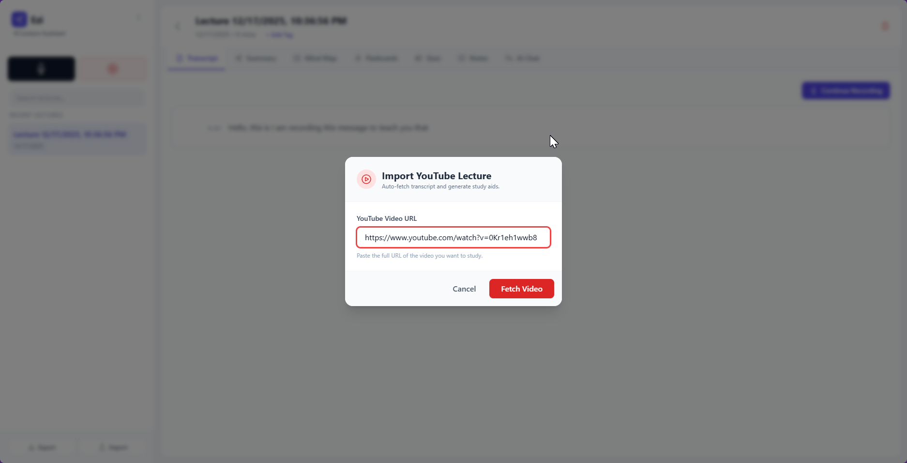
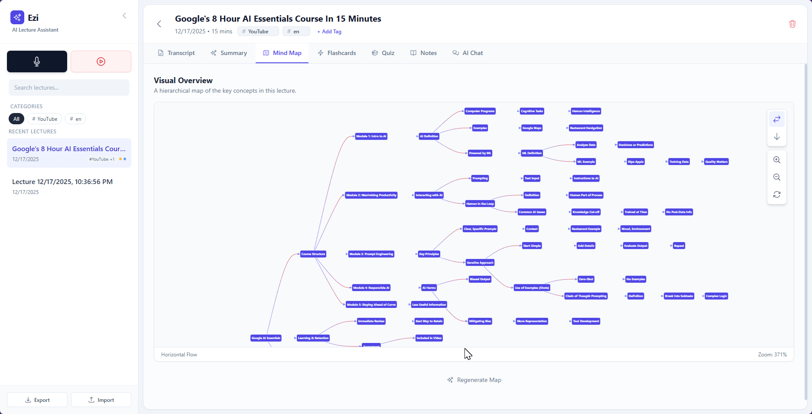
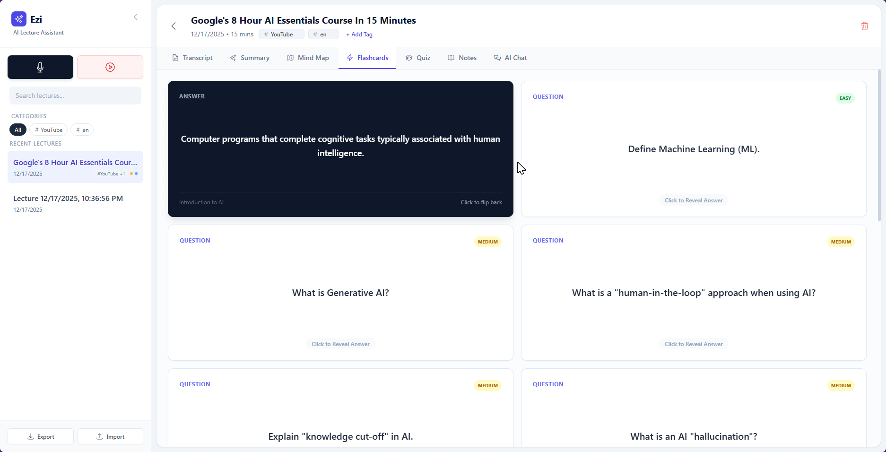
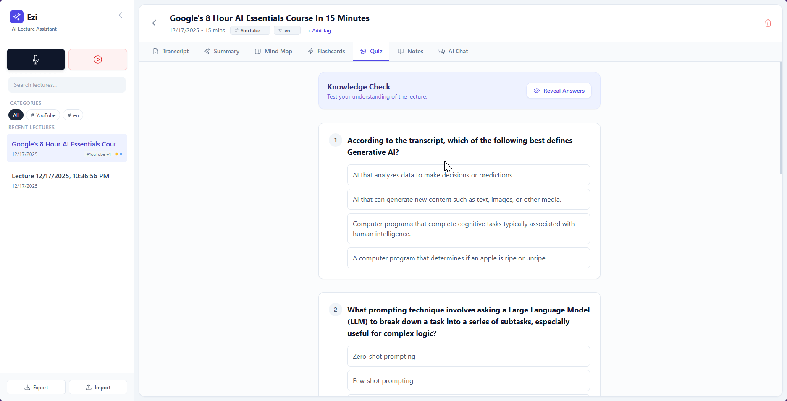
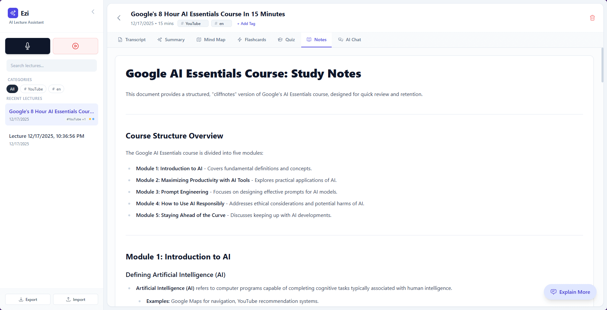
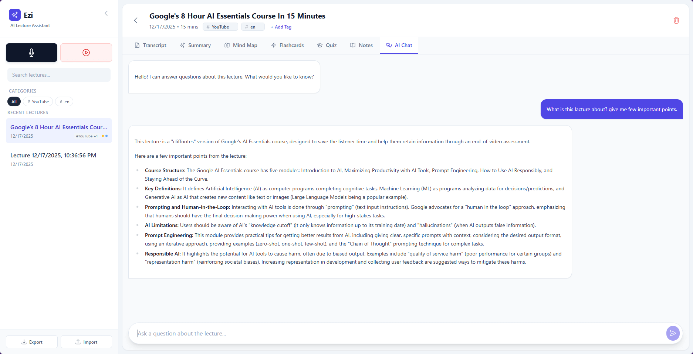
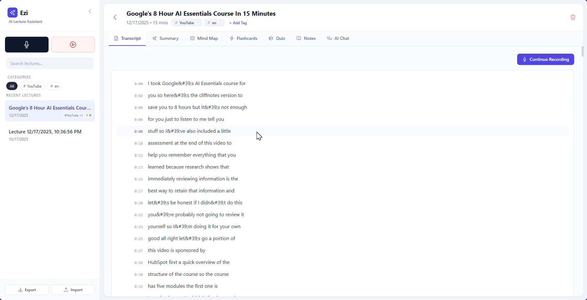
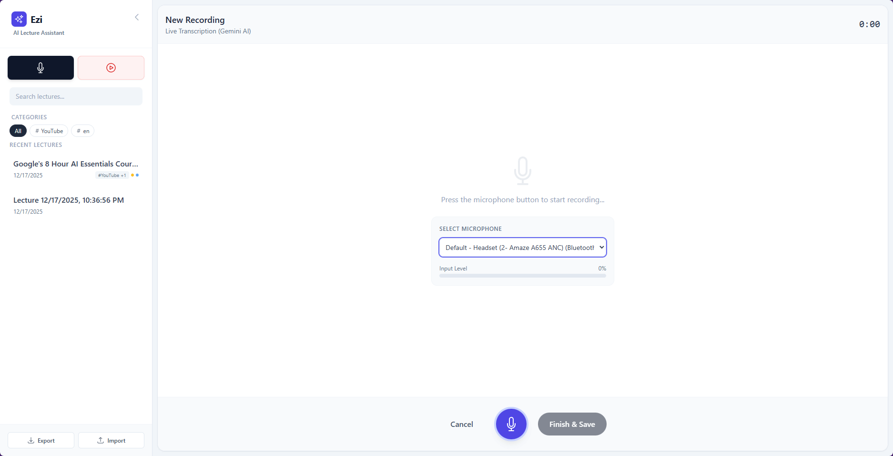

# Ezi Lecture Transcriber (Flashcards & Quiz Generator)

## Project Purpose
**Ezi** is a zero-friction AI lecture assistant designed to help students and professionals convert spoken content into structured study material. By leveraging the **Google Gemini API**, Ezi automates the most time-consuming parts of studying.

### Key Features:
- **Live Transcription:** Real-time speech-to-text directly in the browser.
- **YouTube Import:** Fetch transcripts from educational videos via URL.
- **AI Study Aids:** Instantly generate:
    - Structured Summaries & Key Terms.
    - Interactive 3D Flip Flashcards.
    - Multiple-Choice Quizzes with explanations.
    - Markdown Study Notes with "Deep Dive" explanations.
    - Visual Mind Maps (Tree/Flow layouts) with Zoom/Pan.
- **AI Tutor Chat:** Ask specific questions about the lecture content.
- **Local Persistence:** All data is saved to your browser's `localStorage`.

---

## Screenshots

| Dashboard | Recording |
|-----------|-----------|
|  |  |

| Summary | Flashcards |
|---------|------------|
|  |  |

| Quiz | Study Notes |
|------|-------------|
|  |  |

| Mind Map | AI Chat |
|----------|---------|
|  |  |

---

## ⚠️ CRITICAL SECURITY WARNING
**This project is intended for LOCAL USE ONLY.**

1.  **Client-Side API Usage:** This application initializes the Gemini SDK (`@google/genai`) on the frontend. In a production/online environment, your `API_KEY` would be exposed to anyone inspecting the network traffic.
2.  **Environment Variables:** RapidAPI and Gemini keys are accessed via `process.env`.
3.  **Production Recommendation:** To use this online, you **must** port the API calls (Gemini and RapidAPI) to a secure backend (Node.js, Python, etc.) to act as a proxy and keep your keys hidden.

---

## Setup Instructions

### Prerequisites
- **Node.js** (v18 or higher recommended) - [Download here](https://nodejs.org/)
- A modern web browser (Chrome, Edge, or Brave recommended for microphone APIs).
- A **Google Gemini API Key** (obtainable from [Google AI Studio](https://aistudio.google.com/)).
- A **RapidAPI Key** for the YouTube Transcript service.

### Step 1: Install Dependencies
```bash
npm install
```

### Step 2: Configure Environment Variables

Create a `.env.local` file in the project root with the following variables:

```env
GEMINI_API_KEY=your_gemini_api_key_here
RAPID_API_KEY=your_rapidapi_key_here
RAPID_API_HOST=youtube-captions-transcript-subtitles-video-combiner.p.rapidapi.com
```

> **Important:** The `.env.local` file is gitignored for security. Never commit your API keys.

### Step 3: Run the Development Server
```bash
npm run dev
```

The app will start at `http://localhost:3000`

### Step 4: Grant Permissions
When prompted, allow the browser to access your **Microphone** to enable the recording feature.

---

## How Environment Variables Work

This project uses **Vite** as the build tool. Environment variables are loaded from `.env.local` and exposed to the app via `vite.config.ts`:

```typescript
define: {
  'process.env.GEMINI_API_KEY': JSON.stringify(env.GEMINI_API_KEY),
  'process.env.RAPID_API_KEY': JSON.stringify(env.RAPID_API_KEY),
  'process.env.RAPID_API_HOST': JSON.stringify(env.RAPID_API_HOST)
}
```

> **Note:** If you change environment variables, you must **restart the dev server** for changes to take effect.

---

## Technical Overview
- **Framework:** React 19 with TypeScript
- **Build Tool:** Vite
- **Styling:** Tailwind CSS with Typography plugin.
- **AI Model:** `gemini-2.5-flash` (Optimized for speed and high context window).
- **Visualization:** Mermaid.js for Mind Maps.
- **Markdown:** Marked.js for note rendering.
- **Data:** Handled via standard Web Storage API (`localStorage`).

---

## Audio Capture & Transcription

This app uses a **hybrid approach** for live transcription:

| Component | Technology |
|-----------|-----------|
| **Audio Capture** | Browser Web API (`getUserMedia`, `AudioContext`) |
| **Transcription** | Google Gemini Live API (`@google/genai`) |

### When is Gemini AI Transcription Enabled?

The Gemini Live API is activated **when the user clicks the microphone button** to start a new recording. The flow is:

1. User navigates to **"New Recording"** or clicks **"Continue Recording"** on an existing lecture
2. User selects their microphone from the dropdown (optional)
3. User clicks the **microphone button** to start recording
4. This triggers the `startRecording()` function which:
   - Initializes `GoogleGenAI` with your `GEMINI_API_KEY`
   - Opens a WebSocket connection via `ai.live.connect()`
   - Begins streaming audio to Gemini in real-time

### How It Works (Technical Flow):

```
[User Clicks Mic] 
    → getUserMedia() captures audio
    → AudioContext processes PCM at 16kHz
    → ai.live.connect() opens WebSocket to Gemini
    → Audio chunks sent via session.sendRealtimeInput()
    → Gemini returns inputTranscription events
    → Text displayed in real-time
```

### Configuration Details:

| Setting | Value |
|---------|-------|
| **Model** | `gemini-2.5-flash-native-audio-preview-09-2025` |
| **Audio Format** | PCM 16-bit, 16kHz sample rate, mono |
| **Response Type** | `inputTranscription` (real-time text) |
| **System Prompt** | "You are a professional stenographer. Transcribe the user's speech exactly as spoken." |

> **Note:** This provides better accuracy than the browser's native `webkitSpeechRecognition` API, especially for longer recordings and complex audio.

---

## Troubleshooting

| Issue | Solution |
|-------|----------|
| **"RapidAPI configuration missing"** | Ensure `RAPID_API_KEY` and `RAPID_API_HOST` are set in `.env.local`, then restart the dev server |
| **Microphone not working** | Ensure you are served over `localhost` or `https`. Browsers block microphone access on insecure `http` origins |
| **AI Content failing** | Check the browser console. Usually due to an invalid/expired `API_KEY` or free-tier rate limits |
| **YouTube Import Error** | Verify the video has captions enabled and your RapidAPI credentials are correct |
| **Changes to .env.local not working** | Restart the dev server (`npm run dev`) after modifying environment variables |
